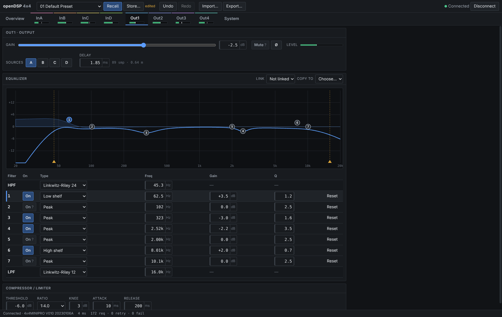

# openDSP-4x4

Open-source control software for the **t.racks DSP 4x4 Mini Pro** (a 4-in / 4-out DSP whose
vendor editor is Windows-only). Runs in desktop Chrome/Edge over WebHID with nothing to install,
and on Android phones/tablets over USB-OTG.

**[Open the web app](https://askz.github.io/opendsp-4x4/)** · plug the DSP in, click *Connect…*



This is a hard fork of [GlassOnTin/opendsp-4x4](https://github.com/GlassOnTin/opendsp-4x4)
with a rebuilt transport, state layer and UI.

## Features

- **All device parameters**: gain, mute, polarity, delay, routing, 7-band PEQ (peak, shelves,
  pass, all-pass), high/low-pass crossovers (Butterworth, Bessel, Linkwitz-Riley), compressor /
  limiter, noise gate, test tone, front-panel lock password.
- **Classic editor layout**: overview of all eight channels plus routing matrix, one tab per
  channel, System page (device facts, 30 preset slots, preset files, issue log). Works at
  phone width.
- **Exact values**: every edit is quantized to the device's own resolution (0.1 dB gain,
  1/30-octave frequency, Q in 0.1 steps, 1/48 ms delay), so what the screen shows is what the
  DSP stores. Verified by reading the device back after writing.
- **Undo / redo** (Ctrl/⌘+Z, Ctrl/⌘+Shift+Z) for every parameter; a fader or EQ-handle drag is
  one step.
- **Delivery tracking**: each parameter shows whether it is sending, rejected, or not sent
  (offline), with a *Resend* action. Nothing fails silently.
- **Presets**: recall/store the 30 device slots (store asks for confirmation); after a recall
  the app re-reads the device so the screen matches what is loaded. **Preset files** export the
  full live state as JSON and import it back as one undoable change, with strict validation.
- **Robust connection**: automatic reconnect when a granted device is plugged back in,
  detection of unplugged or unresponsive devices, meters that never delay a user edit.
- **EQ link** (mirror edits across two outputs) and **copy EQ** between outputs.
- Keyboard: `0` overview, `1`–`8` channels, `9` system; arrows / PageUp / PageDown / wheel step
  numeric fields (Shift ×10, Alt ×0.1); values accept `1.2k`, `-6,5 dB`, …

## Status and known gaps

Desktop (WebHID) is verified on hardware (`4x4MINIPRO V010 20230106A`). The Android shell
builds in CI; the new file import/export bridge still needs a test on a phone.

- **Mute and PEQ-band bypass have no readback** on this device. After connecting they are
  shown as unknown (`?`) until you set them.
- **Gain below −28 dB**: the linear mapping (0 dB = raw 280, 10 raw units/dB) is verified from
  −28 to +12 dB; the device's raw 0 is its minimum, so lower values are not offered.
- **Compressor/gate times** are passed through as raw values. Factory defaults read back as
  49/99/499 where the vendor editor shows 50/100/500 ms, suggesting `ms = raw + 1`
  (unconfirmed).

See [`PROTOCOL.md`](PROTOCOL.md) for the measured protocol, including request/reply rules and
timing.

## Development

```sh
cd web
npm ci
npm run dev            # http://localhost:5173 (WebHID needs Chrome/Edge)
npm run typecheck      # tsc + svelte-check
npm test               # unit tests (node --test)
npm run build
```

- **No hardware?** Open the dev server with `?mock` (e.g. `http://localhost:5173/?mock`) to run
  against a simulated DSP that reproduces the real device's replies and timing.
- **Hardware smoke test (Linux)**: with the DSP plugged in and no browser tab using it,
  `npm run hw:smoke -- /dev/hidrawN` runs the production transport, connection and editor
  against the device through hidraw (find `N` with
  `grep -l 0168 /sys/class/hidraw/*/device/uevent`). It changes Out 1 and a few other
  parameters, restores them, and re-recalls the active preset.
- **Android**: [`ANDROID.md`](ANDROID.md) explains the WebView shell and USB bridge;
  `android/build-apk.sh` builds a debug APK (Android SDK + JDK 17). CI builds one on every push.

### Architecture

```
web/src/
  protocol/   frame codec, command builders, readback decoders, reply rules (pure)
  transport/  HidLink (WebHID / Android bridge / mock) → RequestChannel
              (one transaction in flight, reply matching, retries, priority lanes, coalescing)
  dsp.ts      typed client for every command
  state/      connection lifecycle · parameter registry · editor (undo, links, delivery
              tracking) · readback → model · preset files · Svelte store facade
  shell/ views/ channel/ ui/   Svelte 5 UI
```

Everything below `shell/`/`views/` is plain TypeScript with unit tests; the UI only calls the
store facade.

## Repo layout

- [`PROTOCOL.md`](PROTOCOL.md): wire protocol (frame format, commands, data model, timing).
- [`web/`](web/): protocol codec, transport, state and UI (also bundled into the Android shell).
- [`android/`](android/): WebView shell + Kotlin USB-host and file bridges.
- [`docs/CAPTURING.md`](docs/CAPTURING.md): recording a USB session to help support more devices.

## Legal

Independent, clean-room interoperability implementation: the protocol was developed by
observing the device's USB-HID traffic and probing the device. "the t.racks" is a trademark of
Thomann; this project is not affiliated with or endorsed by Thomann.

Licensed under the **GNU AGPL-3.0-or-later** (see [`LICENSE`](LICENSE)): any distributed or
network-served derivative must publish its source under the same terms.

    Copyright (C) 2026 Ian Williams
    Modified 2026 by askz (https://github.com/askz/opendsp-4x4): new transport, state layer and UI.

    This program is free software: you can redistribute it and/or modify it under the
    terms of the GNU Affero General Public License as published by the Free Software
    Foundation, either version 3 of the License, or (at your option) any later version.
